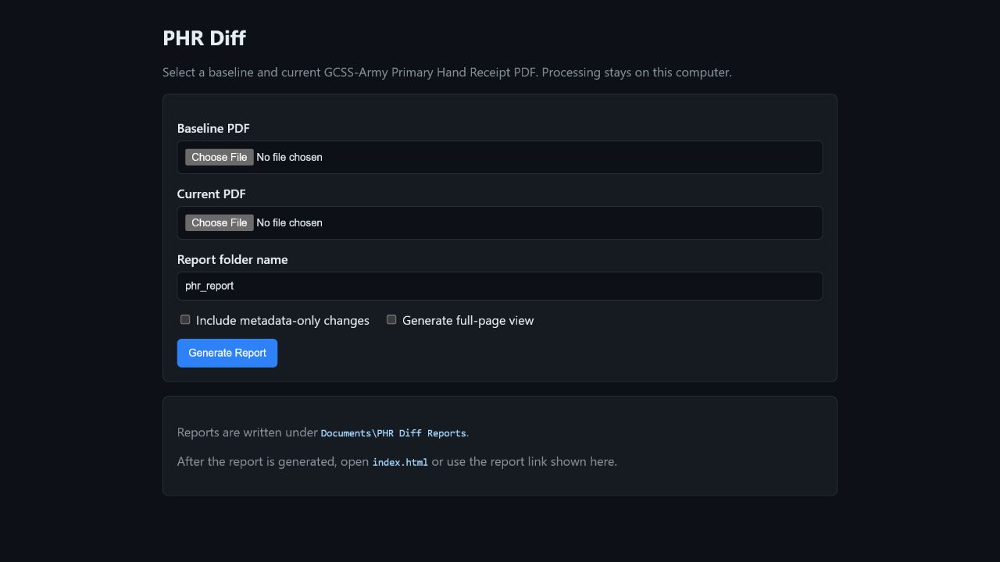
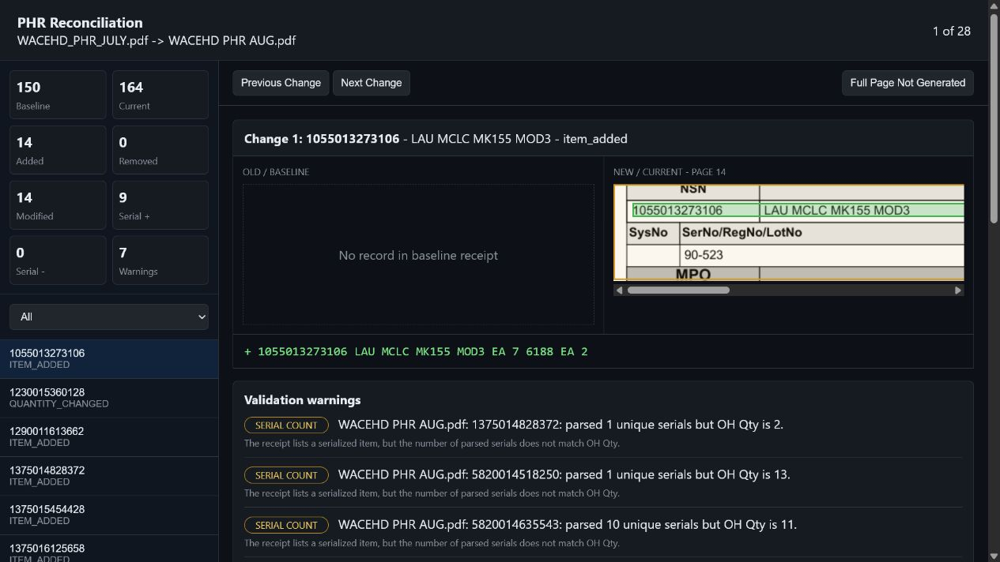
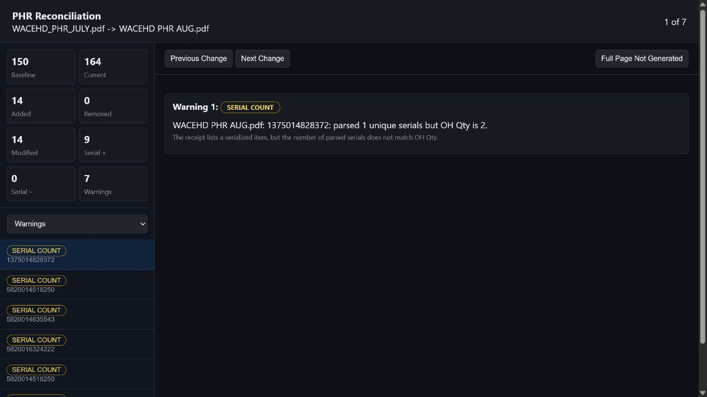

# PHR Diff

PHR Diff compares two GCSS-Army Primary Hand Receipt PDFs and creates a local GitHub-style visual reconciliation report.

The app compares structured PHR data first, then uses the original PDFs only for visual crops and highlights. It does not upload files, call cloud APIs, or use image comparison as the source of truth.

## Screenshots

### Upload Screen

Double-clicking the packaged executable opens a local browser page for selecting the baseline and current PDFs.



### Visual Reconciliation Report

The report shows a split view with the baseline receipt on the left and the current receipt on the right.



### Tagged Validation Warnings

The `Warnings` filter in the left sidebar switches to warning-specific entries. Each warning has a tag and a short explanation.



## For Non-Technical Users

Use the packaged Windows executable:

```text
dist\PHRDiff.exe
```

Steps:

1. Double-click `PHRDiff.exe`.
2. Choose the baseline PDF.
3. Choose the current PDF.
4. Pick a report folder name.
5. Click `Generate Report`.
6. Open the generated visual report from the link shown after processing.

Reports are written under:

```text
Documents\PHR Diff Reports
```

The executable is unsigned, so Windows may show a SmartScreen warning the first time it runs.

## Command-Line Usage

Install dependencies:

```powershell
pip install -r requirements.txt
```

Run a comparison:

```powershell
python -m phr_diff fixtures/WACEHD_PHR_JULY.pdf fixtures/"WACEHD PHR AUG.pdf"
```

Useful options:

```powershell
python -m phr_diff OLD.pdf NEW.pdf --output .\phr_report --no-open
python -m phr_diff OLD.pdf NEW.pdf --json-only
python -m phr_diff OLD.pdf NEW.pdf --include-metadata-changes
python -m phr_diff OLD.pdf NEW.pdf --full-pages
```

Options:

- `--output`: report directory, default `phr_report`
- `--no-open`: generate files without opening a browser
- `--json-only`: write only `reconciliation.json`
- `--debug`: print validation warnings
- `--include-metadata-changes`: include description/UI/CIIC/DLA/BUoM changes in the visual change list
- `--full-pages`: render full-page images for the report's full-page mode

## GUI From Source

Run:

```powershell
python phr_diff_gui.py
```

For local testing without opening a browser automatically:

```powershell
python phr_diff_gui.py --port 8766 --no-open
```

Smoke-test the GUI entry point:

```powershell
python phr_diff_gui.py --smoke-test
```

## Building The EXE

Build a fresh Windows executable:

```powershell
.\build_exe.ps1
```

The build output is:

```text
dist\PHRDiff.exe
```

The executable is a one-file PyInstaller build that bundles Python, PyMuPDF, and the application code.

Smoke-test the packaged executable:

```powershell
.\dist\PHRDiff.exe --smoke-test
```

Expected output:

```text
PHRDiff web GUI smoke test ok
```

## Architecture

Pipeline:

```text
old PDF -> parser -> HandReceipt
new PDF -> parser -> HandReceipt
HandReceipt pair -> comparator -> Reconciliation
Reconciliation + PDFs -> locator/renderer -> HTML split report
```

Main modules:

- `phr_diff.parser`: extracts structured PHR records and PDF coordinates with PyMuPDF.
- `phr_diff.compare`: compares normalized records semantically.
- `phr_diff.validation`: emits tagged validation warnings.
- `phr_diff.renderer`: renders PDF crops and optional full-page images.
- `phr_diff.report`: writes `index.html`, assets, and `reconciliation.json`.
- `phr_diff.web_gui`: local browser-based GUI for non-technical users.
- `phr_diff.cli`: command-line entry point for `python -m phr_diff`.

## Output Files

A normal report directory contains:

```text
index.html
reconciliation.json
assets/
  crops/
  pages/        # only when full-page mode is enabled
```

`index.html` is portable and can be opened locally in a browser.

`reconciliation.json` contains the structured comparison, warning list, tagged warning details, and image payloads used by the HTML report.

## Validation Warning Tags

Warnings are shown with tags so users can tell what kind of review is needed:

- `SERIAL COUNT`: parsed serial count does not match OH Qty.
- `LOT QTY`: lot quantity total does not match OH Qty.
- `DUPLICATE STOCK`: duplicate stock-number records were found.
- `DUPLICATE SERIAL`: duplicate serial identifiers were found.
- `COORDINATE`: a parsed value could not be tied back to a PDF location.
- `VISUAL BOX`: a changed value lacks a visual highlight box.
- `PARSER`: text extraction or row parsing needs review.
- `VALIDATION`: general human-review warning.

## Tests

Run:

```powershell
pytest
```

The test suite covers:

- synthetic parser cases
- semantic comparison
- warning classification
- coordinate detection
- real fixture integration using the July and August PDFs
- crop/report generation

## Known Limitations

- Duplicate stock-number records are preserved and warned, but reconciliation currently compares the first occurrence for each stock number.
- The parser is tuned to the GCSS-Army PHR table geometry shown by the supplied fixtures.
- A few fixture records list fewer serial identifiers than their OH Qty. These are reported as tagged validation warnings.
- Scanned PDFs are not supported yet. Image registration or OCR would be a future fallback.

## Data Handling

PHR Diff is designed for sensitive local documents:

- PDFs stay on the user's computer.
- No telemetry is sent.
- No external services are called.
- The GUI runs on `127.0.0.1` only.

